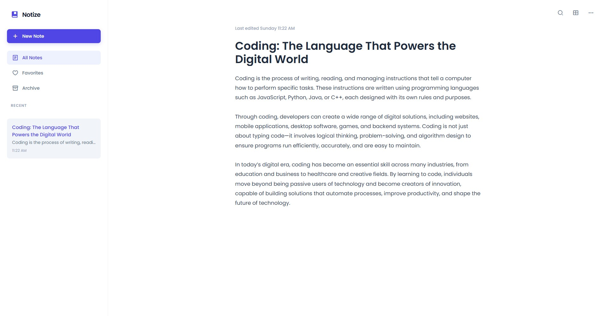

<div align="center">


<br />
<br />


</div>

<br/>

## Notize

Notize is a clean and intuitive web-based application for taking, organizing, and managing notes. Built with a focus on minimalist aesthetics and professional architecture, it provides a borderless, distraction-free environment for your thoughts. The project utilizes Domain-Driven Design (DDD) on the backend and a feature-based pattern on the frontend to ensure a scalable and maintainable codebase.

## Preview

<p align="center">
  
</p>

## Features

- **Borderless Design Language:** A Dribbble-inspired UI that removes unnecessary visual noise, focusing entirely on your content.
- **Domain-Driven Architecture:** A robust Laravel backend structured with Actions and Repositories for clean separation of business logic.
- **Real-time Synchronization:** Instant debounced autosaving ensures your notes are always up to date without overwhelming the API.
- **Advanced Organization:** Easily manage your note lifecycle with "Favorites" for priority access and "Archive" for completed thoughts.
- **Dynamic View Modes:** Toggle between "Comfortable" and "Compact" views to match your workflow and information density needs.
- **Global Search:** Instant, real-time filtering across note titles and bodies using a high-performance frontend implementation.
- **Modern Tech Integration:** Powered by Preact for ultra-fast UI rendering and TypeScript for end-to-end type safety.

## Tech Stack

- **Preact:** A fast 3kB alternative to React with the same modern API.
- **TypeScript:** Enterprise-grade type safety ensuring a robust developer experience.
- **Laravel 10 (DDD):** A sophisticated backend implementation using Domain-Driven Design principles.
- **SQLite:** A lightweight, reliable database engine for local and production-ready persistence.
- **Vite:** Next-generation frontend tooling for an ultra-fast development cycle.
- **Remix Icons:** A comprehensive, high-quality icon set for a consistent visual experience.

## Getting Started

To get a local copy of this project up and running, follow these steps.

### Prerequisites

- **PHP 8.1** or higher.
- **Node.js 20.x** or higher.
- **Composer** for PHP dependency management.

## Installation

### 1. Backend Setup (API)

```bash
cd api
composer install
copy .env.example .env
php artisan key:generate
php artisan migrate
php artisan serve --port 8000
```

### 2. Frontend Setup (Client)

```bash
cd client
npm install
npm run dev
```

Access the application at [http://localhost:5173](http://localhost:5173).

## Documentation

The project includes comprehensive documentation:
- **Backend:** Fully documented using **PHPDoc** for all Domain Actions, Repositories, and Models.
- **Frontend:** Detailed **TSDoc** annotations for components, services, and custom hooks.

## License

All rights reserved. This project is for educational purposes and portfolio demonstration only.
